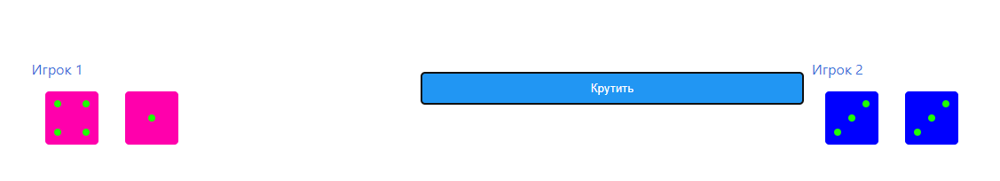

# Децентрализованное приложение на основании смарт-контракта Dice2. (Не работает ставки и кубы)

# Запуск
``` 
  npm start-ganache
```
``` 
  npm start
```

# Очистка памяти:
## для Windows
```
 npm clear-windows
```
## для MacOS
```
 npm clear-mac
```

#  Вид приложения

 
