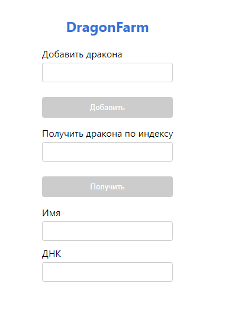

# Децентрализованное приложение на основании смарт-контракта Dragon Farm.

# Запуск
``` 
  npm start-ganache
```
``` 
  npm start
```

# Очистка памяти:
## для Windows
```
 npm clear-windows
```
## для MacOS
```
 npm clear-mac
```


#  Вид приложения
 

