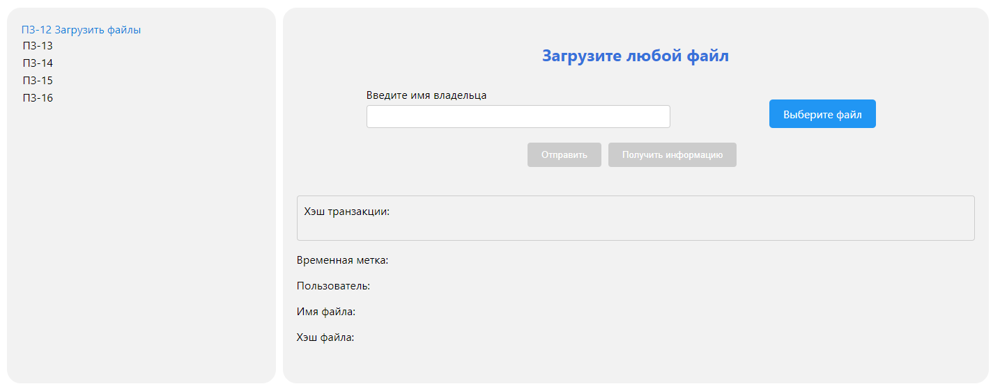
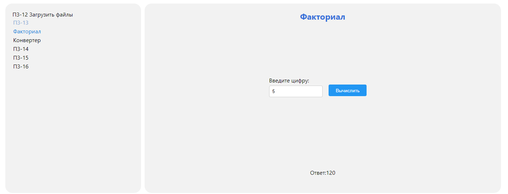
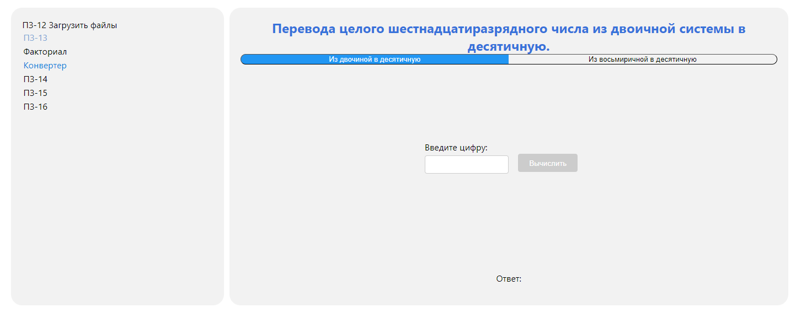
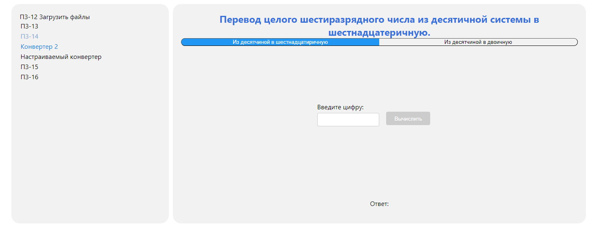
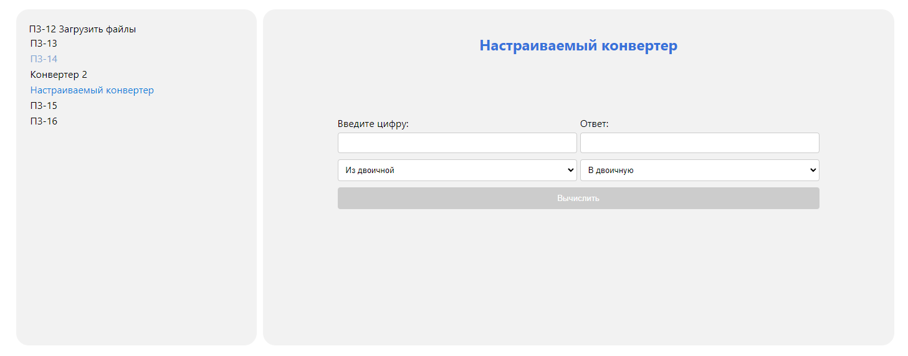
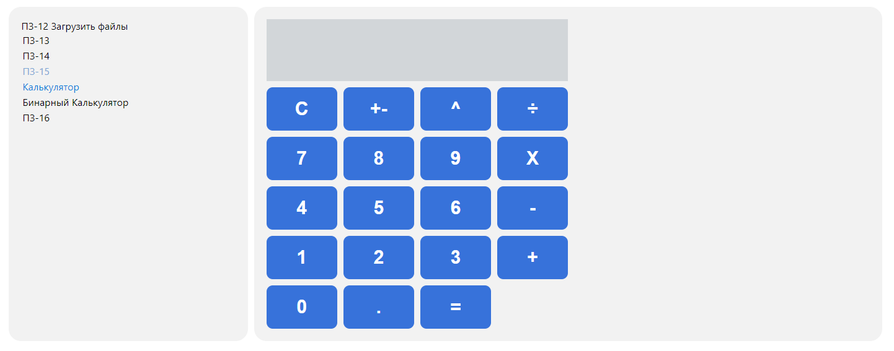
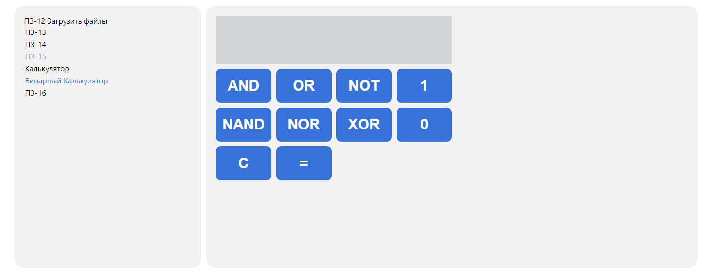
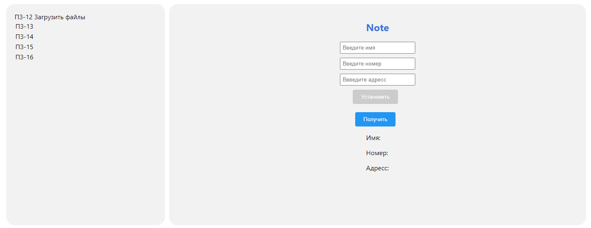
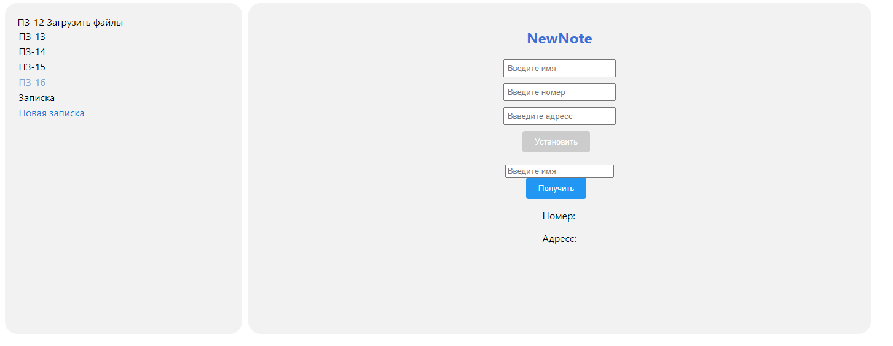

# Децентрализованное приложение на основании смарт-контракта .

# Запуск
``` 
  npm start-ganache
```
``` 
  npm start
```
#  Вид приложения для контракта  UploadFiles

 

#  Вид приложения для контракта  Factorial

 

#  Вид приложения для контракта  Converter

 

#  Вид приложения для контракта  AdvanceConverter

 

#  Вид приложения для контракта  CustomConverter

 

#  Вид приложения для контракта  Calculator

 

#  Вид приложения для контракта  BinaryCalculator

 

#  Вид приложения для контракта  Note

 

#  Вид приложения для контракта  NewNote

 


